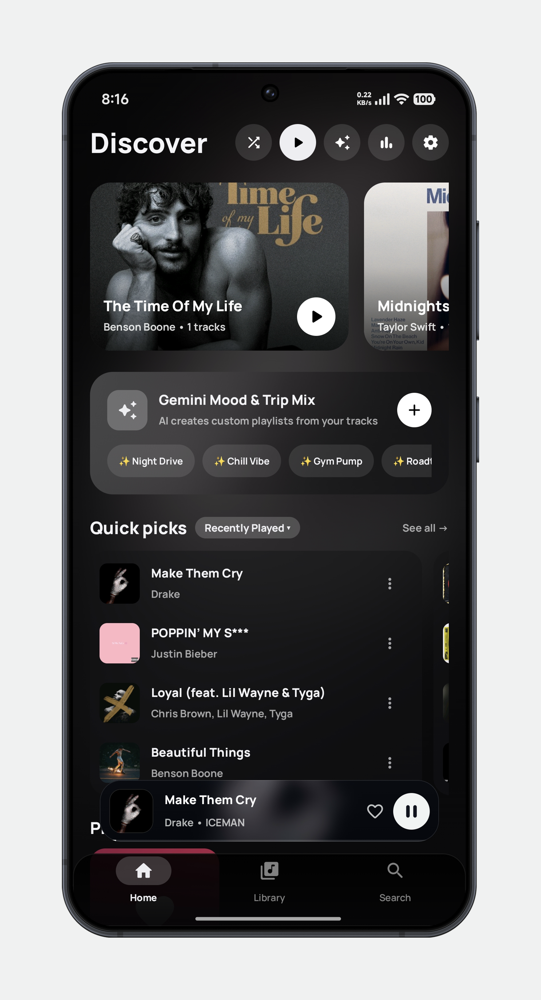
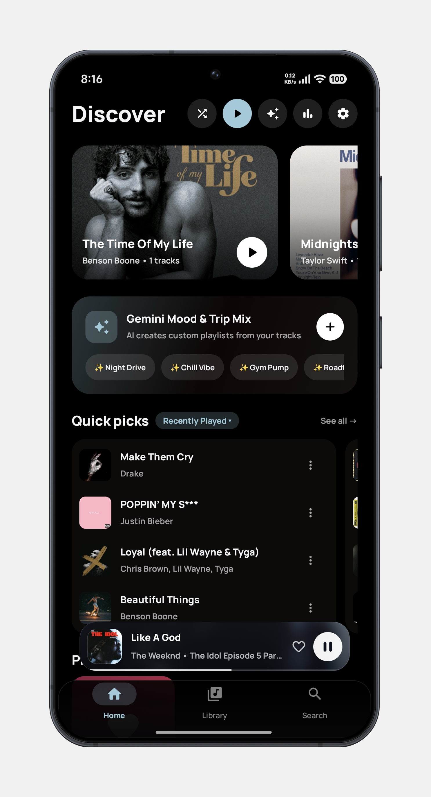
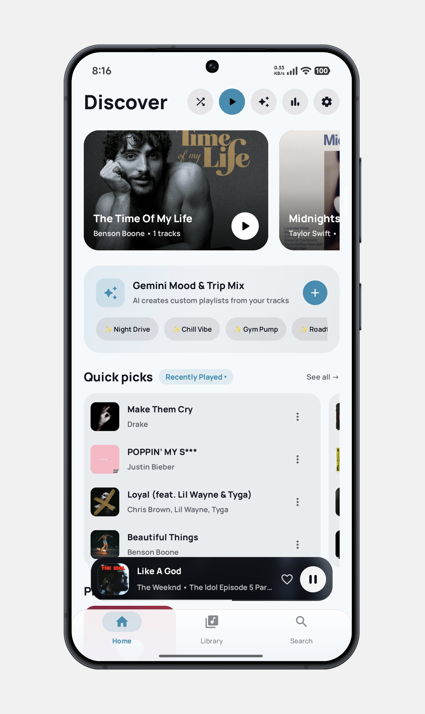
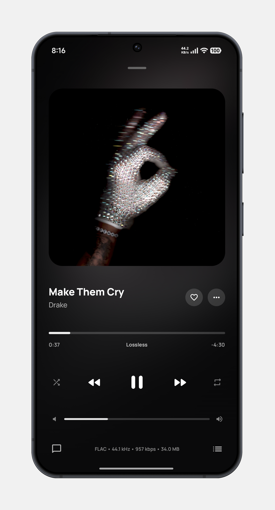
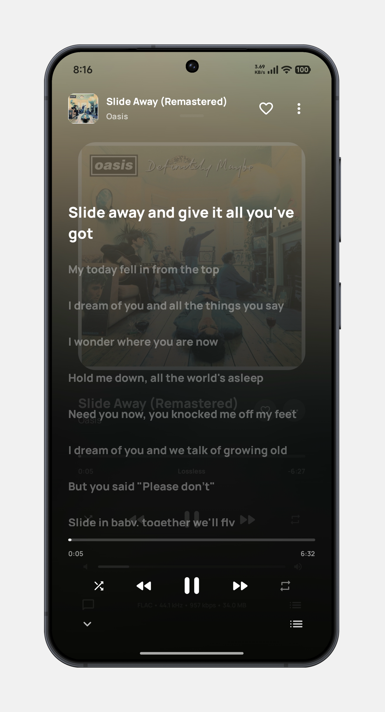
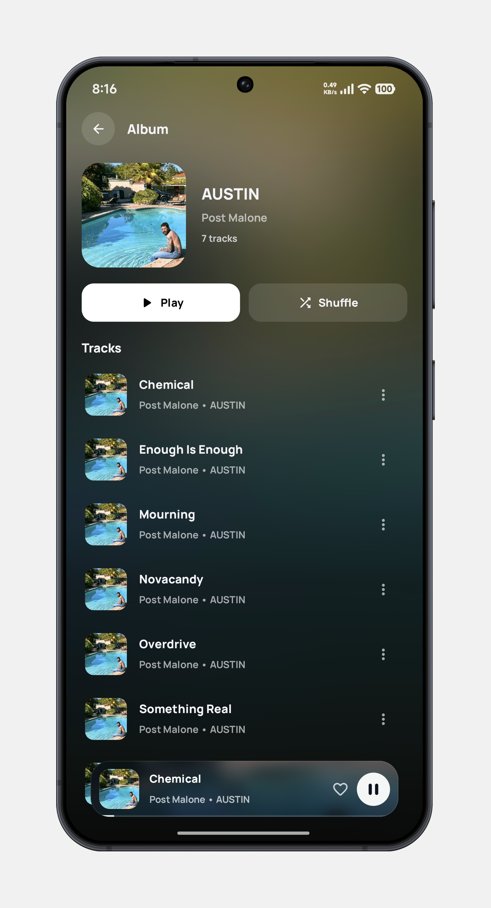
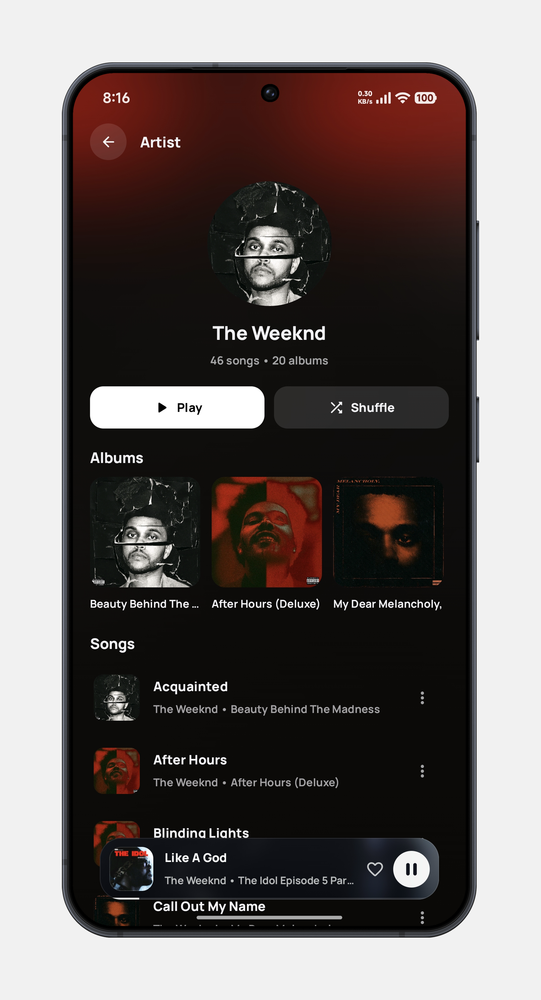
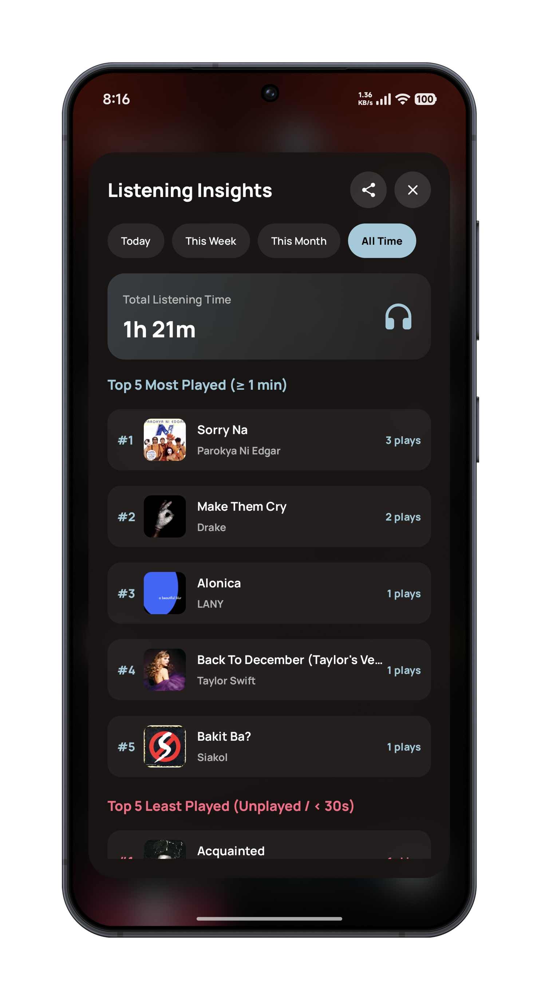
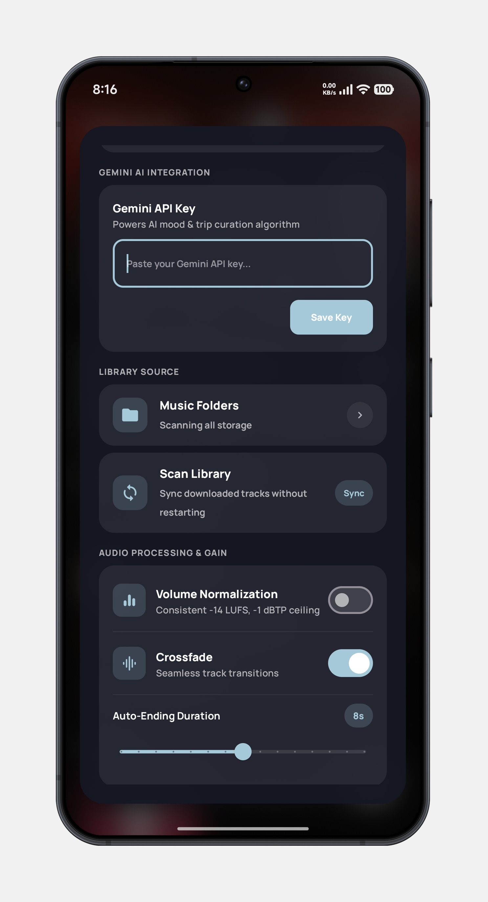

# OreoTunes

### Your music. Your mood. Your atmosphere. 🎧

**OreoTunes is a modern Android music player built around your local music library.**

It combines offline music playback with immersive album artwork, dynamic colors, powerful queue controls, playlists, lyrics, listening insights, metadata tools, and a highly customizable listening experience.

> 🎵 **Your music library, redesigned.**

---

## ✨ Highlights

- 🎵 Local and offline music playback
- 🖼️ Dynamic album artwork and artwork-based colors
- 🎧 Immersive Now Playing experience
- 📚 Albums, artists, songs, folders, and playlists
- 🔎 Fast library search with search history
- ▶️ Persistent playback state
- 📋 Improved queue management
- 📊 Listening statistics and insights
- 📝 Metadata editing and online metadata lookup
- 🎤 Lyrics support
- 🤖 Optional AI-powered mood and trip playlists
- 🎨 Light, dark, and AMOLED themes
- 🎚️ Crossfade and loudness normalization
- 🎛️ Hi-Fi / bypass playback options
- 🔌 Bluetooth and USB DAC detection
- 🔄 Safer and more reliable library refresh
- ⚙️ Extensive playback and appearance customization

---

## 🎵 Music Playback

OreoTunes is designed for reliable local music playback without requiring a streaming service.

### Library

Browse your personal collection through:

- Songs
- Albums
- Artists
- Folders
- Playlists
- Search

Music is read from the device's local media library and can be played offline.

### Playback

Playback includes:

- Play / pause
- Previous / next track
- Queue management
- Shuffle
- Repeat
- Crossfade
- Loudness normalization
- Hi-Fi / bypass playback where supported
- Playback notification controls
- Bluetooth audio support
- USB DAC detection

---

## ▶️ Persistent Playback State

OreoTunes preserves important playback state so your listening session can survive interruptions and app restarts.

The playback system tracks:

- Current song
- Playback position
- Queue
- Shuffle state
- Repeat state

This allows OreoTunes to restore the listening session instead of starting over whenever the app is reopened.

---

## 📋 Queue Experience

The queue has been improved to make managing upcoming music easier.

Supported queue actions include:

- Play Next
- Add to Queue
- Reorder tracks
- Remove tracks
- Clear the queue
- Handle the currently playing track correctly

The goal is to make the queue feel like a first-class part of the music player rather than a temporary playback list.

---

## 📚 Library Management

OreoTunes includes a safer library refresh system designed for large and changing music collections.

Library refresh improvements include:

- Safer rescans
- Better handling of changed media
- Better handling of deleted or moved tracks
- Reduced unnecessary work
- Improved refresh reliability
- Scan status feedback

Your music library can therefore change on the device without requiring an unnecessarily expensive full refresh every time.

---

## 🔎 Search

Search has been improved to make finding music faster and more useful.

Search supports the local music library and includes search-history functionality for previously used searches.

Use search to quickly find:

- Songs
- Albums
- Artists
- Other available library content

---

## 🎼 Playlists

OreoTunes provides local playlist management for organizing your music.

Playlist quality-of-life improvements include easier playlist interaction and improved handling of playlist contents.

Playlists can also be used as the foundation for mood-based and trip-oriented listening sessions.

---

## 📝 Metadata Editor

OreoTunes includes tools for editing and improving local music metadata.

The metadata workflow can work with online music databases and artwork services to help identify and enrich tracks.

Supported integrations include:

- MusicBrainz
- iTunes lookup
- Cover Art Archive

This makes it easier to maintain a clean and organized local music collection.

---

## 🎤 Lyrics

OreoTunes supports lyrics viewing from the playback experience.

Lyrics are designed to remain part of the listening experience rather than requiring a separate application.

---

## 📊 Listening Insights

OreoTunes includes a dedicated **Listening Insights** experience for exploring playback statistics.

Available timeframes include:

- Today
- This Week
- This Month
- All Time

Insights include:

- Total listening time
- Total plays
- Full plays
- Skips
- Unique tracks
- Most played tracks
- Least played / unplayed tracks
- Top artists

The statistics system distinguishes qualifying full plays from shorter playback events and provides a dedicated modern statistics interface.

Listening insights can also be exported for sharing.

---

## 🤖 AI Mood & Trip Playlists

OreoTunes can optionally use Gemini AI to help create playlists based on a desired mood or listening situation.

Example moods include:

- 😊 Happy
- 🌙 Chill
- 💙 Sad
- ⚡ Energetic
- 🎯 Focus
- ❤️ Romantic
- 🕰️ Nostalgic
- 😌 Relaxed
- 🏋️ Workout
- 🚗 Road Trip

AI playlist generation is optional and is intended to complement—not replace—the local music library.

---

## 🎨 Immersive Album-Art Experience

Album artwork is an important part of the OreoTunes interface.

The player can use artwork to influence the visual atmosphere of the listening experience through:

- Dynamic album-art backgrounds
- Blurred artwork atmosphere
- Artwork color extraction
- Dynamic interface colors
- Immersive Now Playing visuals
- Animated visual effects

The goal is simple:

**Every song should feel visually connected to its artwork.**

---

## 🌗 Themes & Appearance

OreoTunes supports multiple visual modes:

- Light mode
- Dark mode
- AMOLED mode

Appearance customization includes:

- Custom accent colors
- Artwork scale
- Corner-radius customization
- Dynamic artwork colors
- Theme-aware interface components

The interface is designed to maintain visual consistency across light and dark environments.

---

## 🎧 Audio & Hardware

OreoTunes provides additional controls for users who care about playback quality and external audio hardware.

Features include:

- Crossfade
- Loudness normalization
- Hi-Fi / bypass playback
- Bluetooth audio detection
- USB DAC detection

Availability of certain audio features depends on the Android device, audio hardware, and playback path.

---

## 📱 Modern Android

OreoTunes is built with modern Android technologies:

- **Kotlin**
- **Jetpack Compose**
- **Material 3**
- **AndroidX**
- **Media3 / ExoPlayer**
- **Kotlin Coroutines**
- **Coil**
- **Android Palette**

### Current application configuration

- **Version:** 1.1.0
- **Minimum Android:** 8.0 (API 26)
- **Target Android:** API 35
- **Compile SDK:** API 35
- **Application ID:** `com.kurixutian.oreotunes`

---

## 📸 Screenshots

### Home

  
  

  

### Playback

  
  

### Library

  
  

### Insights & Settings

  
  

---

## 🛠️ Development

OreoTunes is an open-source Android music player project focused on providing a polished local music listening experience.

Current development priorities include:

- Playback reliability
- Library management
- Music discovery within the local library
- Playlist quality of life
- Metadata management
- Listening statistics
- Audio controls
- Appearance customization
- Documentation and release quality

---

## 🗺️ v1.1.0 Progress

The major v1.1.0 feature roadmap is complete.

| Area | Status |
|---|---|
| Persistent playback state | ✅ Done |
| Better queue experience | ✅ Done |
| Better library refresh | ✅ Done |
| Better playback resilience | ✅ Done |
| Search improvements | ✅ Done |
| Playlist QoL | ✅ Done |
| Metadata editor improvements | ✅ Done |
| Statistics / UI improvements | ✅ Done |
| Settings cleanup | ✅ Done |
| Documentation / release polish | ✅ Done |

v1.1.0 is the completed release milestone for these improvements. Future updates can build on this foundation with additional quality-of-life features, playback improvements, and refinements.

---

## 🔐 Privacy

OreoTunes is designed primarily around your personal local music library.

Local music playback and library features operate on music available through the device's media storage.

Some optional features may use network services, including online metadata, artwork, update-checking, or AI functionality.

Network-dependent features are separate from the core offline playback experience.

---

## ⭐ Support OreoTunes

If you enjoy OreoTunes, you can support the project by:

- ⭐ Starring the GitHub repository
- 🐛 Reporting bugs
- 💡 Suggesting improvements
- 📣 Sharing OreoTunes with other music enthusiasts

Every bit of support helps the project continue to improve.

---

## 🤝 Contributing

Contributions, bug reports, feature ideas, and feedback are welcome.

When reporting an issue, include:

- Android version
- Device model
- OreoTunes version
- Steps to reproduce the problem
- Relevant logs or screenshots when available

---

## 📄 License

OreoTunes is licensed under the **Apache License 2.0**.

Copyright © 2026 Christian Lim.

See the [`LICENSE`](LICENSE) file for the complete license text.

---

  <strong>OreoTunes</strong> 
  Your music. Your mood. Your atmosphere. 🎧

